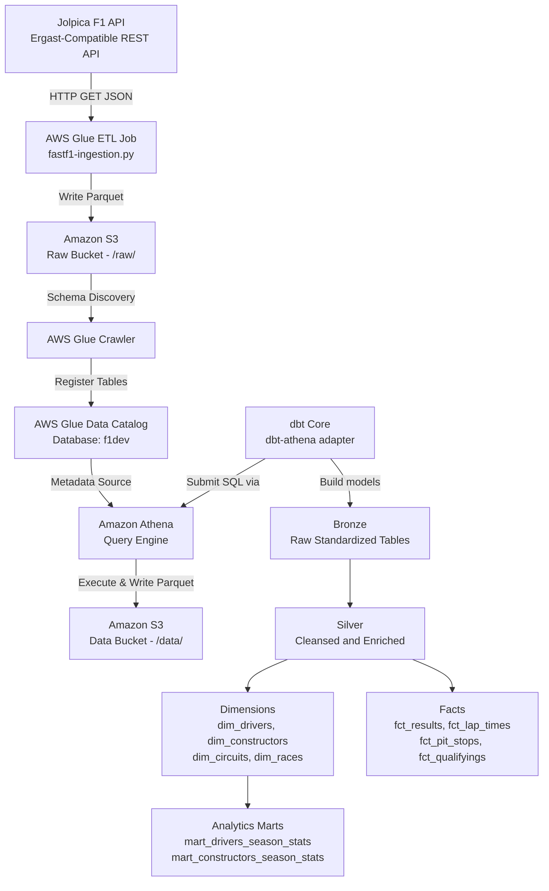

# 🏎️ Formula 1 Enterprise Data Pipeline (AWS Athena & dbt)

> ℹ️ **Migration Notice**: This repository is a cloud-native AWS migration of the original Formula 1 Data Analytics platform built on **Databricks** (Unity Catalog & Delta Lake). You can review the original Databricks implementation here: [GovIndLok/f1-dbt-analytics](https://github.com/GovIndLok/f1-dbt-analytics).

---

## 📌 Executive Summary & Architectural Rationale

This project provides an end-to-end serverless data engineering pipeline designed to ingest, process, catalog, and model Formula 1 racing telemetry and historical data.

### 💡 Why Migrate to AWS Athena + dbt?
- **Serverless & Cost-Optimized**: Eliminates compute cluster idle costs associated with Databricks by leveraging **Amazon Athena** (pay-per-query, scanned bytes model) and **Amazon S3** object storage.
- **Open Standards**: Stores data in open **Apache Parquet** format, integrated via **AWS Glue Data Catalog**.
- **Modern Data Stack (MDS)**: Combines **dbt-athena** for modular SQL modeling, version-controlled transformations, and automated testing with AWS serverless infrastructure.
- **API Resilience**: Replaced decommissioned Ergast API dependencies with **Jolpica Ergast API** (`https://api.jolpi.ca/ergast/f1`), featuring built-in rate-limiting resilience and automated retries.

---

## 🏗️ End-to-End System Architecture

The pipeline implements a **Medallion Architecture (Bronze → Silver → Gold)** orchestrating data from external REST APIs to downstream analytics-ready data marts.



---

## 📊 Medallion Data Architecture & Modeling

The dbt project standardizes raw data into analytics-grade Star Schemas:

| Layer | Schema | Purpose & Materialization | Key Datasets / Models |
| :--- | :--- | :--- | :--- |
| **Source** | `f1dev` | External tables auto-cataloged by AWS Glue Crawler from raw S3 dumps. | `circuits`, `constructors`, `drivers`, `races`, `results`, `sprint_results`, `qualifying`, `pit_stops`, `lap_times` |
| **Bronze** | `bronze` | Standardized schemas, uniform column casing, and casting raw string values. Materialized as `table` in Athena S3. | `bronze_circuits`, `bronze_constructors`, `bronze_drivers`, `bronze_races`, `bronze_results`, `bronze_sprint_results`, `bronze_qualifyings`, `bronze_pit_stops`, `bronze_lap_times`, `bronze_seasons`, `bronze_driver_standings`, `bronze_constructor_standings` |
| **Silver** | `silver` | Cleansed, deduplicated entities, surrogate key generation, and metric parsing. Materialized as `table` in Athena S3. | `silver_circuits`, `silver_constructors`, `silver_drivers`, `silver_races`, `silver_results`, `silver_sprint_results`, `silver_qualifyings`, `silver_pit_stops`, `silver_lap_times`, `silver_driver_num` |
| **Gold** | `gold` | Star Schema dimensional model and analytical marts for business intelligence. Materialized as `table` in Athena S3. | **Dimensions**: `dim_drivers`, `dim_constructors`, `dim_circuits`, `dim_races`<br/>**Facts**: `fct_results`, `fct_lap_times`, `fct_pit_stops`, `fct_qualifyings`<br/>**Marts**: `mart_drivers_season_stats`, `mart_constructors_season_stats` |

---

## 🛠️ Data Engineering Best Practices & Quality Control

1. **Schema Isolation Macro**:
   Custom dbt macro (`macros/generate_schema.sql`) overrides default dbt schema prefixing, keeping environments clean across `bronze`, `silver`, and `gold` schemas.
2. **Columnar Storage & Compression**:
   All dbt models are stored as optimized **Apache Parquet** files on S3 to minimize Athena query execution scanning costs.
3. **Data Quality Assurances**:
   Rigorous data assertions configured via `schema.yml` across all layers:
   - Primary key uniqueness and non-null checks (`driverId`, `raceId`, `constructorId`).
   - Foreign key referential integrity constraints between facts and dimensions.
   - Range validation and accepted values tests on race positions and season stats.
4. **API Rate Limiting & Fault Tolerance**:
   The ingestion script handles HTTP `429` rate limits from the Jolpica API using exponential backoff retries and page offset management.

---

## 🚀 Setup & Testing Guide for AWS Secondary Accounts

Follow this operational playbook to deploy and test the pipeline in another AWS account or environment.

### 📋 Prerequisites
- **AWS CLI v2** installed and configured (`aws configure`).
- **Python 3.11+** with `uv` package manager (or standard `pip`).
- An **AWS Account** with IAM permissions for S3, Glue, Athena, and CloudWatch.

---

### Step 1: Security & IAM Policy Requirements

Ensure your AWS IAM role/user has the following minimum permissions:
- `s3:GetObject`, `s3:PutObject`, `s3:ListBucket`, `s3:DeleteObject` on the target S3 bucket.
- `athena:StartQueryExecution`, `athena:GetQueryExecution`, `athena:GetQueryResults`, `athena:GetWorkGroup`.
- `glue:CreateDatabase`, `glue:GetDatabase`, `glue:CreateTable`, `glue:GetTable`, `glue:BatchCreatePartition`, `glue:GetPartitions`.

---

### Step 2: Provision AWS Infrastructure

1. **Create Target S3 Bucket**:
   ```bash
   aws s3 mb s3://<your-target-s3-bucket> --region <your-aws-region>
   ```

2. **Create Glue Data Catalog Database**:
   ```bash
   aws glue create-database --database-input "{\"Name\":\"f1dev\",\"Description\":\"F1 Data Catalog Database\"}"
   ```

3. **Verify Athena Workgroup**:
   Ensure an Athena workgroup (e.g. `primary`) is active with query results location set to `s3://<your-target-s3-bucket>/athena-results/`.

---

### Step 3: Run Data Ingestion & Crawling

1. **Set Environment Variable**:
   ```bash
   export S3_BUCKET=<your-target-s3-bucket>
   ```

2. **Execute Ingestion**:
   - **Local Execution**:
     ```bash
     python glue_scripts/fastf1-local-test.py
     ```
   - **AWS Glue Execution**:
     Upload `glue_scripts/fastf1-ingestion.py` to AWS Glue and launch with parameters:
     `--S3_BUCKET=<your-target-s3-bucket>`, `--S3_PREFIX=raw`.

3. **Crawl Raw Data**:
   Create and trigger an AWS Glue Crawler on `s3://<your-target-s3-bucket>/raw/` pointing to database `f1dev`.

---

### Step 4: Local Workspace & dbt Configuration

1. **Clone Repository & Install Dependencies**:
   ```bash
   git clone https://github.com/GovIndLok/aws-f1-pipeline.git
   cd aws-f1-pipeline
   uv sync
   source .venv/bin/activate  # On Linux/WSL (.venv\Scripts\activate on Windows)
   ```

2. **Configure `~/.dbt/profiles.yml`**:
   Add the `f1_athena` target profile:

   ```yaml
   f1_athena:
     target: dev
     outputs:
       dev:
         type: athena
         s3_staging_dir: s3://<your-target-s3-bucket>/dbt-staging/
         s3_data_dir: s3://<your-target-s3-bucket>/data/
         s3_data_naming: schema_table
         region_name: <your-aws-region>   # e.g. us-east-1
         schema: f1dev
         database: awsdatacatalog
         workgroup: primary
   ```

---

### Step 5: Execute & Validate dbt Models

```bash
cd f1_athena

# 1. Test database connection & Athena authentication
dbt debug

# 2. Load static seeds
dbt seed

# 3. Build Bronze, Silver, and Gold Medallion models
dbt run

# 4. Run data quality tests
dbt test

# 5. Build and preview interactive documentation
dbt docs generate
dbt docs serve
```

---

## 🔧 Operations, Maintenance & Troubleshooting

| Problem | Root Cause | Solution |
| :--- | :--- | :--- |
| `HIVE_CANNOT_OPEN_SPLIT` | S3 path changed or underlying Parquet files deleted. | Run `MSCK REPAIR TABLE <table_name>;` in Athena or rerun `dbt run --full-refresh`. |
| `Access Denied (Service: Amazon S3)` | Missing S3 bucket permissions or Athena staging path misconfigured. | Verify IAM permissions for `s3_staging_dir` and `s3_data_dir` in `profiles.yml`. |
| `TABLE_NOT_FOUND (f1dev.<table_name>)` | Glue Crawler has not run or database name mismatch. | Trigger Glue Crawler on `s3://{S3_BUCKET}/raw/` and verify `f1dev` database in Glue Catalog. |
| API Rate Limit `429` | Rapid Jolpica API requests exceeding burst quota. | Ingestion script automatically backs off. Adjust `max_retries` in `fastf1-ingestion.py` if needed. |

---

## 📁 Repository Directory Structure

```text
├── glue_scripts/
│   ├── fastf1-ingestion.py        # AWS Glue PySpark/Python job for Jolpica API ingestion
│   ├── fastf1-local-test.py       # Standalone Python script for local testing & ingestion
│   └── Updating Glue Script.md    # Schema mapping specifications and Jolpica endpoints
├── f1_athena/
│   ├── dbt_project.yml            # Main dbt project configuration
│   ├── packages.yml               # Installed dbt package dependencies
│   ├── macros/
│   │   └── generate_schema.sql    # Custom schema naming override macro
│   ├── models/
│   │   ├── source/                # Source configuration mapped to AWS Glue Data Catalog
│   │   ├── bronze/                # Raw standardization dbt models (13 SQL models)
│   │   ├── silver/                # Cleansing & key mapping dbt models (14 SQL models)
│   │   └── gold/                  # Analytics Star Schema (4 Dims, 4 Facts, 2 Marts)
│   └── seeds/                     # Static seed CSV files
├── pyproject.toml                 # Dependencies (dbt-athena, boto3, fastf1, botocore)
└── README.md                      # Project documentation
```
